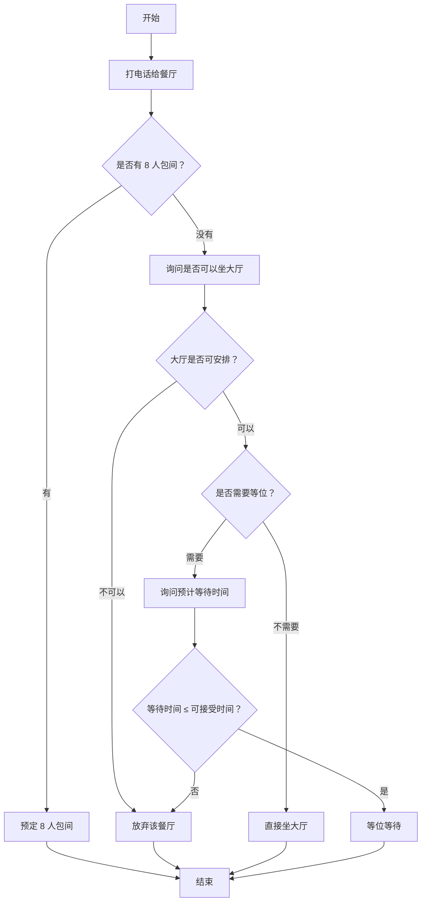

```mermaid
flowchart TD
    A[开始] --> B[打电话给餐厅]
    B --> C{是否有 8 人包间？}

    C -- 有 --> D[预定 8 人包间]
    D --> Z[结束]

    C -- 没有 --> E[询问是否可以坐大厅]
    E --> F{大厅是否可安排？}

    F -- 不可以 --> Y[放弃该餐厅]
    Y --> Z

    F -- 可以 --> G{是否需要等位？}

    G -- 不需要 --> H[直接坐大厅]
    H --> Z

    G -- 需要 --> I[询问预计等待时间]
    I --> J{等待时间 ≤ 可接受时间？}

    J -- 是 --> K[等位等待]
    K --> Z

    J -- 否 --> Y


```
