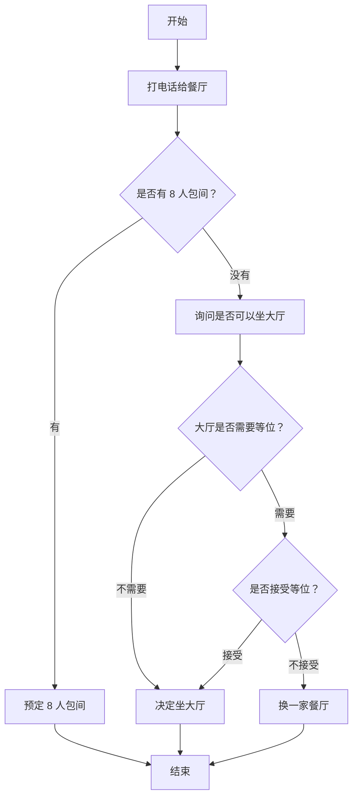

```mermaid
flowchart TD
    A[开始] --> B[打电话给餐厅]
    B --> C{是否有 8 人包间？}

    C -- 有 --> D[预定 8 人包间]
    D --> E[结束]

    C -- 没有 --> F[询问是否可以坐大厅]
    F --> G{大厅是否需要等位？}

    G -- 不需要 --> H[决定坐大厅]
    H --> E

    G -- 需要 --> I{是否接受等位？}
    I -- 接受 --> H
    I -- 不接受 --> J[换一家餐厅]
    J --> E

```
