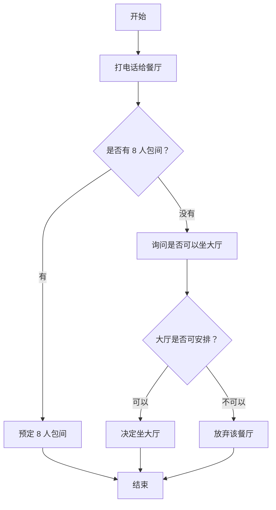

```mermaid
flowchart TD
    A[开始] --> B[打电话给餐厅]
    B --> C{是否有 8 人包间？}

    C -- 有 --> D[预定 8 人包间]
    D --> E[结束]

    C -- 没有 --> F[询问是否可以坐大厅]
    F --> G{大厅是否可安排？}

    G -- 可以 --> H[决定坐大厅]
    H --> E

    G -- 不可以 --> I[放弃该餐厅]
    I --> E

```
